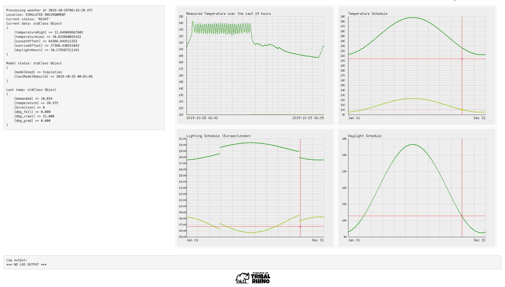
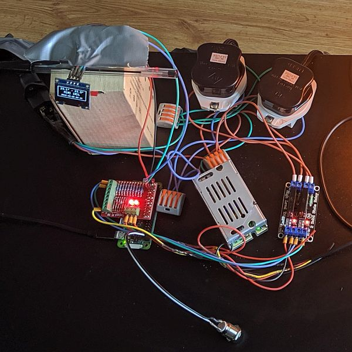
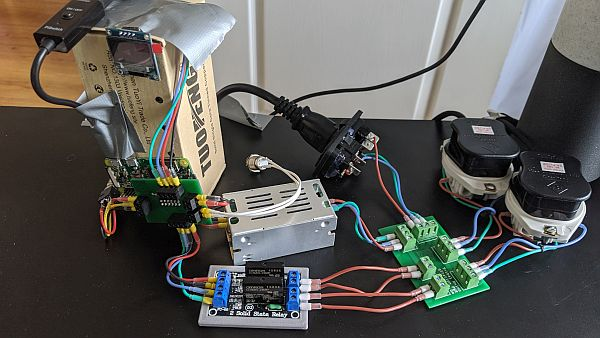
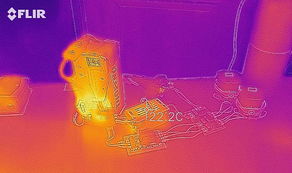
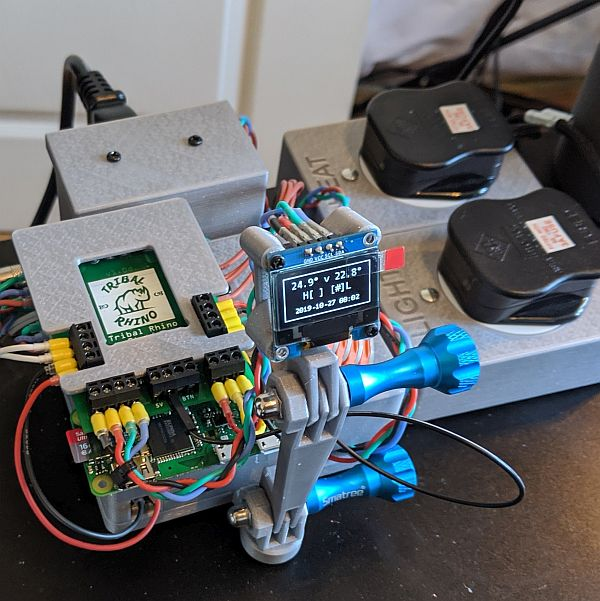
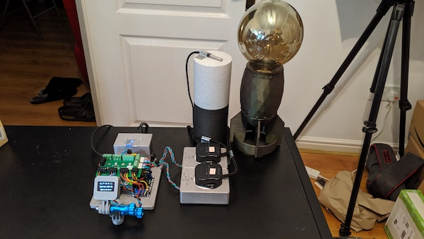
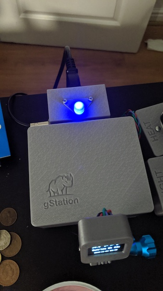
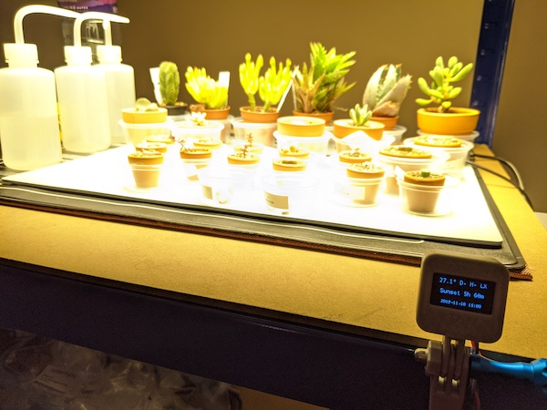

## Contents

* [Overview](#Overview)
* [Limitations](#Limitations)
* [Setting up the Pi](#Setting-up-the-Pi)
* [Roadmap](#Roadmap)
* [Hardware Requirements and other useful bits](#Hardware-requirements)

## Overview

At it's core this is simply (currently) a controller for a heat pad and a light. Out of the box it will use a northern hemisphere 
concept of when summer is (solstice in June) and a 28.8°C high. You can also sign up for a [DarkSky](https://darksky.net/dev) account
which will let you configure your experience to a place on the earth. 

There is also a web interface which provides some feedback about how the temperature has been over the last 24 hours and 
graphs on what is being planned.

The project is currently adequate for running a single Deep Water Culture (DWC) bucket in a grow tent or maybe mushrooms if you replace 
the heat with a humidifier. It is also suitable for a single reptile vivarium. This project is being worked on in my spare time, but the 
plan is to allow up to 4 sensors and 7 triggers meaning you can have up to 4 reptile vivariums or DWC buckets (Assuming they have the
same envirnomental requirements), or maybe a much more complex single growing environment, requiring heating/cooling/dehumidfying/humidifying/venting
in 3 zones and lighting across the whole environment... or a combination of any of that.

## Limitations

This app and everything in it are so pre-release that there isn't a version number yet, but it is affectionately referred to as 
Version 1 or 'the beast'.

This application is not designed to be exposed to the internet and be secure.

You're stuck with temperatures in Centigrade for now and quite some time.

This app uses a solid state relay to control the lights and heat pad. The one I have found reasonbably cheaply
is only rated at 2 amps per channel. Version 2 of teh beast will handle 5A per channel.

There is only 1 sensor and 2 output triggers. Version 2 of the beast will allow up to 4 one-wire sensors and a serial CO2 sensor
as well as up to 7 triggers. The sensors supported are the DS18B20 for temerature, the DHT11, and DHT22 for temperature and humidity, 
and I'm adding the MH-Z19B for Carbon Dioxide.

There is only 1 'environment' modelled. This means the demands for heat and light are across all of the 'zones' you set up, so you cannot 
have a temperature plan for a root zone as a separate plan for the air zone. I do not expect this to change in the foreseable future.
You can have separate triggers run heaters in different zones based on the sensors you assign to that zone but the demanded temps 
will be the same. I may add a delta in the command structure so you can set things to be -2 degrees of the demanded value for example.

The web interface is very limited and needs to be refreshed manually. This will change to automatically updating and 
allowing for some parameter control in the future.

The control (sensor definition, trigger logic and environmental modelling) is handled  through a config file on the pi. This will move 
to the web interface in time. If you can install everything then this will not be a problem for you. The config file is located at 
`/webroot/gStation/config_override.php`.

Please see the [Roadmap](##Roadmap) section for details on some of things that will come and fix some of these points.

## Setting up the Pi

There are a couple of assumptions if you want to use this stuff. First is that you have a bit of knowledge about what
youre doing with regard to Installing an operating system on a raspberry pi (Zero in this case). It is also assumed 
that you have command line access to ssh (mac/linux for example) or know how to configure something like PuTTY on 
windows. How you write images to SD cards is also highly dependant on your operating system, but you can find out 
more information in the [Raspian documentation][RASPBIANINSTALL] and google is your friend.

 * Burn the latest [Raspian **Lite**][RASPIAN] image to an Micro/SD card (8GB is more than enough).
 * Drop res/wpa_supplicant.conf from here into the boot disk
 * Update that file with the details from your router
 * Drop res/ssh file from here into the boot disk

Boot the PI and log in (password will initally be raspberry).

    rm -rf ~/.ssh/known_hosts
    ssh pi@raspberrypi.local

Change the password and run the configurator.

    passwd
    sudo raspi-config

Make the folllowing changes.

 * Network Options -> Hostname
 * Interfaceing options -> I2C -> yes
 * Exit (and do the reboot)

Next, log back in to the new hostname with the new password, then, update Raspian and install all the software packages we need.

    sudo apt update -y
    sudo apt upgrade -y
    sudo apt install -y apache2 php php-mbstring php-gd mariadb-server php-mysql git python3-dev python3-pip python3-pil i2c-tools python3-gpiozero wiringpi
    sudo pip3 install --upgrade pip setuptools wheel Adafruit_DHT datetime adafruit-circuitpython-ssd1306
    sudo phpenmod mysqli

Make the directories we require for our software

    sudo mkdir /logs
    sudo chown -R pi:www-data /logs
    sudo chmod -R g+w /logs
    sudo mkdir /webroot

Clone the software into its home.

    cd /webroot
    sudo git clone https://github.com/nigeljohnson73/gStation.git
    sudo chown -R pi:www-data /webroot
    sudo chmod -R g+w /webroot
    cd gStation
    cat config.php | grep -v "^$" | grep -v "^//" > config_override.php

Move the new DHT11 overlay into the correct place.

    sudo rm -f /boot/overlays/dht11.dtbo
    sudo cp res/dht11.dtbo /boot/overlays

Move the webroot stuff around.

    cd /var/www/
    sudo mv html html_orig
    sudo ln -s /webroot/gStation html
    sudo /etc/init.d/apache2 restart

Set up MySQL with the correct root account and a user for the application.

    sudo mysql --user=root < /webroot/gStation/res/install.sql

Update the user login script so it has a pretty banner and stuff.

    echo "source /webroot/gStation/res/bashrc" | tee -a ~/.bashrc

Change the I2C refresh rate.

    echo "dtparam=i2c_baudrate=1000000" | sudo tee -a /boot/config.txt

Configure the system to set up the GPIOs on boot in the rc.local file.

    cat /etc/rc.local | grep -v 'exit 0' | sudo tee /etc/rc.local
    echo ". /webroot/gStation/res/rc.local" | sudo tee -a /etc/rc.local
    echo "exit 0" | sudo tee -a /etc/rc.local

Update the crontab to have our update commands.

    crontab -e

Add these lines:

    1 0 * * * /usr/bin/php /webroot/gStation/sh/gstation_update.php > /tmp/gstation_update.txt 2>/dev/null
    * * * * * /usr/bin/php /webroot/gStation/sh/gstation_tick.php > /tmp/gstation_tick.txt 2>/dev/null

## The journey so far

This started out as a pile of wires and some gaffer tape.

With the introduction of a couple of custom PCB's the wires were tidied up nicely. Gaffer tape was still obligatory at this point.

Running 1.8 amps through one of the channels and there are no significant hot spots on the far right.

Finally a single case with a new 'for-show' PCB and it's mostly done and pretty.

The design was a little disappointing and didn't warrant the exposure of the painful electrical bits, so a big box was 
called for.

Saddened by the lack of gaffer tape... the next best thing was called for: a HUGE blue LED.

Finally, here it is installed under my succulent care station.

## Roadmap

The first thing I am doing is upgrading the sensor and trigger capability. The sensors need to report asychronously to the trigger 
controlling part of the application.

Once on the actual journey, the key focus for me will be to work on the web interface. It just needs some sheduling to get the 
graph image files in the background and update them in the browser. Once this is in place then the tool will be useful enough
to warant a proper version number.

The next key ingredient will be the ability to control the existing control parameters via the web interface.

The final step before an actual release version will be the ability to control the dynamics of a growing season for hydroponics.
The idea is that you can set a cold period to start for X days, then ramp up a veg season for Y days and then flower until we stop.

I am also building some 3D printed parts to hold things and provide a box for all the electronics... but a maplin box and hot-glue
will do just as good a job.

I will probably make up some kits at some point for sale on my website. I can also assemble things, but a full assembly takes me about 
a day so is a very expensive option, and limited to the spare time I have available.

## Hardware requirements

Version 2 is completely different and will have more details soon, but version 1 is as follows:

This is quite a list if you want to get into the nitty gritty. But if you have 20AWG for the 240v side and 
optionally 24AWG for the  5v side, ferrules if you're using them, as well as all the tools (soldering iron etc),
then there is less to work out. You will need to substitute parts below if you live outside the UK... and you can 
if you want to reduce cost and can get things outside of  Amazon Prime for example. I have also built my own 
custom PCB to route wires, but I'll outline where things are plugged in so you can do this in your favourite way.

 * [Mains power input socket][PARTPOWERIN]. this one needs a [250v 6.3A fuse][PARTFUSE], but you can simplify this a lot.
 * [5v PSU][PARTPSU]. You can substutute a Pi power cable instead. Attach to the 5v power pin - pin 2 or 4.
 * [Solid state relay pair][PARTSSR]. Heat trigger on GPIO17 - pin 11, Light on GPIO18 - pin 12, 5v for Vcc.
 * [OLED screen][PARTOLED] . Uses the I2C connections and 3.3v for VCC.
 * [Momentary push button][PARTBUTTON]. Bridge ground to GPIO14 - pin 8, or GPIO21 - pin 40.
 * [Temperature sensor][PARTTEMP]. Data wire to GPIO4 - pin 7, vcc is 3.3v.
 * [Plug socket][PARTPLUG] (x2) to run the power to the heat pad and light, attach in part to the solid state relay and 240v side.
 * [A heat pad][PARTHEAT]
 * [A light][PARTLIGHT]
 * [A Raspberry Pi Zero][PARTPI]
 * [An SD card][PARTSDCARD]
 
## Resources used

Here is a list of things I found useful on my journey.

* [Configure wireless before booting][SUPLICANT]
* [Enable SSH before booting][SSH]
* [LAMP on a Raspberry PI][LAMP]
* [Button press off][BUTTON]
* [Solid State Relay tutorial][SSR]
* [Solid State Relay video][SSRVIDEO]
* [DS18B20 Digital termocouple tutorial][DS18B20]
* [OLED wiring diagram and tutorial][OLED]
* [Decent GPIO pinout][GPIOPIOUT]

## Improvments

An I2C bus temp/humidity sensor for environmental monitoring.

* [AM2315 on Amazon][AM2315]
* [HDC1080 on Amazon][HDC1080]
* [BME280 on Amazon][BME280]

PID tuned Heat controller for stopping the oscilation in the heater.

* [PhD Thesis on PID tuning][PIDTUNE]

## Software discarded

I incorporated some of this stuff, but then moved on a bit. I thought I'd keep it in case I need it again later.

### DHT22 Humidity and temperature module

* [General overview][DHT22OVERVIEW]
* [Data logger example][DH22LOGGER]
* [Adafruit library for python][DH22ADAFRUIT]

[GPIOPIOUT]: https://raw.githubusercontent.com/DigitalLumberjack/mk_arcade_joystick_rpi/master/wiki/images/mk_joystick_arcade_GPIOsb+.png
[DH22ADAFRUIT]: https://github.com/adafruit/Adafruit_Python_DHT
[DH22LOGGER]: https://www.instructables.com/id/Raspberry-PI-and-DHT22-temperature-and-humidity-lo/
[DHT22OVERVIEW]: https://pimylifeup.com/raspberry-pi-humidity-sensor-dht22/
[OLED]: https://www.raspberrypi-spy.co.uk/2018/04/i2c-oled-display-module-with-raspberry-pi/
[DS18B20]: http://www.circuitbasics.com/raspberry-pi-ds18b20-temperature-sensor-tutorial/
[SSRVIDEO]: https://www.youtube.com/watch?v=Q6v8BnDT47I
[BUTTON]: https://github.com/TonyLHansen/raspberry-pi-safe-off-switch/
[SSR]: https://tech.iprock.com/?p=10030
[SUPLICANT]: https://howchoo.com/g/ndy1zte2yjn/how-to-set-up-wifi-on-your-raspberry-pi-without-ethernet
[SSH]: https://howchoo.com/g/ote0ywmzywj/how-to-enable-ssh-on-raspbian-without-a-screen
[LAMP]: https://howtoraspberrypi.com/how-to-install-web-server-raspberry-pi-lamp/
[AM2315CODE]:https://code.google.com/archive/p/am2315-python-api/
[AM2315]: https://smile.amazon.co.uk/dp/B07VF17C7N
[HDC1080]: https://smile.amazon.co.uk/dp/B07DJ7FLHS
[BME280]: https://smile.amazon.co.uk/dp/B07KY8WY4M
[PIDTUNE]: https://studentnet.cs.manchester.ac.uk/resources/library/thesis_abstracts/MSc14/FullText/Ioannidis-Feidias-fulltext.pdf
[RASPIAN]: https://www.raspberrypi.org/downloads/raspbian/
[RASPBIANINSTALL]:https://www.raspberrypi.org/documentation/installation/installing-images/README.md
[PARTPOWERIN]: https://uk.rs-online.com/web/p/iec-connectors/3521831/
[PARTFUSE]: https://smile.amazon.co.uk/dp/B07DS3X4XT
[PARTSSR]: https://smile.amazon.co.uk/dp/B07BVXT8L5
[PARTPSU]: https://smile.amazon.co.uk/dp/B073GPSY4T
[PARTOLED]: https://smile.amazon.co.uk/dp/B07NLVK4D5
[PARTTEMP]: https://smile.amazon.co.uk/dp/B01M4NGFKF
[PARTPLUG]: https://uk.rs-online.com/web/p/plug-sockets/5000459
[PARTHEAT]: https://smile.amazon.co.uk/dp/B07GYWRNNY
[PARTLIGHT]: https://smile.amazon.co.uk/dp/B07L57Z5TP
[PARTPI]: https://thepihut.com/products/raspberry-pi-zero-w?variant=547421782033
[PARTSDCARD]: https://smile.amazon.co.uk/dp/B073K14CVB
[PARTBUTTON]: https://smile.amazon.co.uk/dp/B075WT4T75
